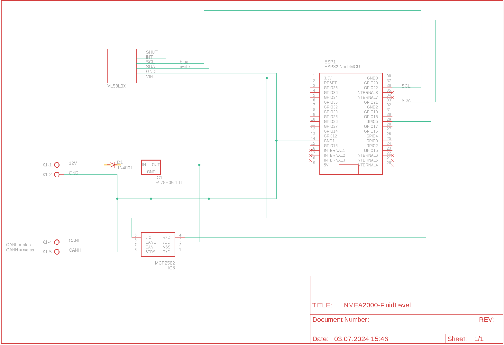
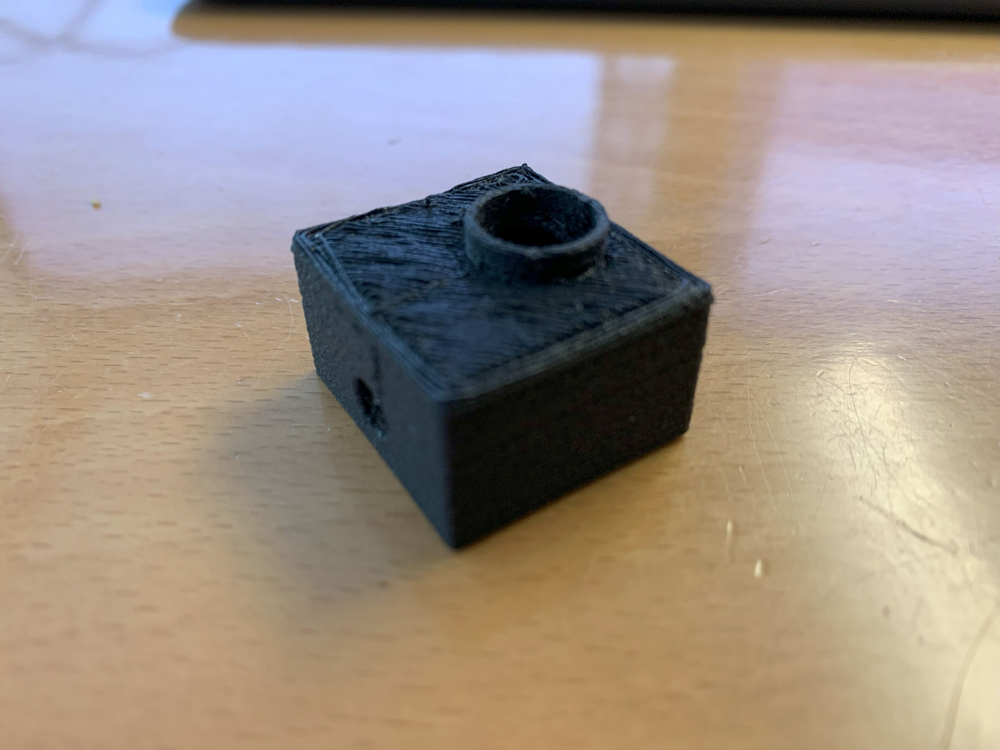
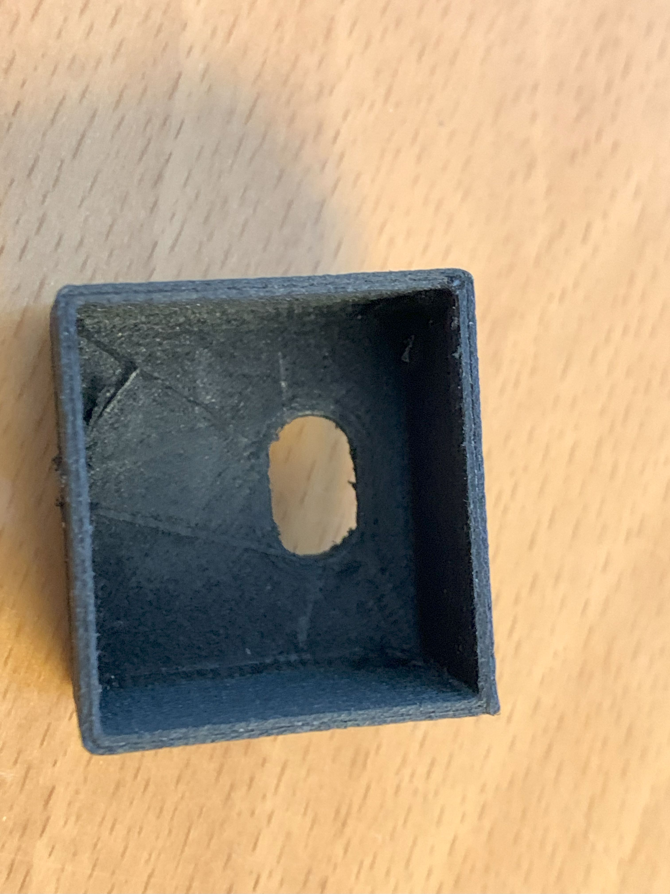
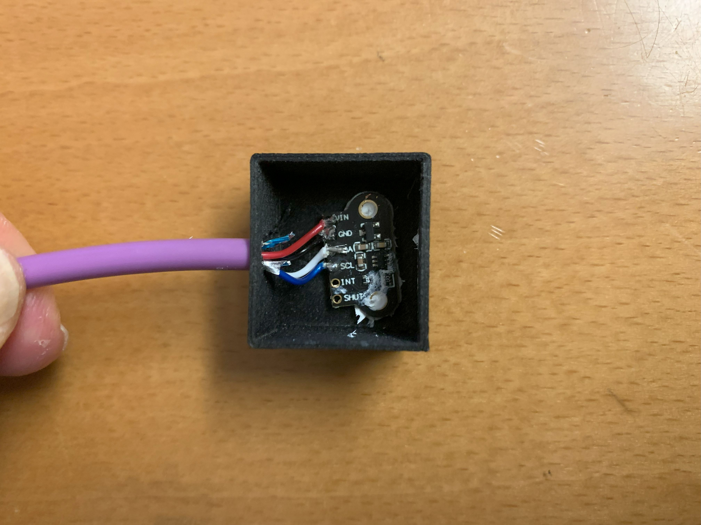
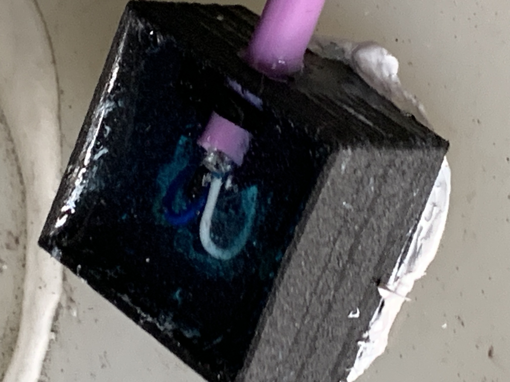
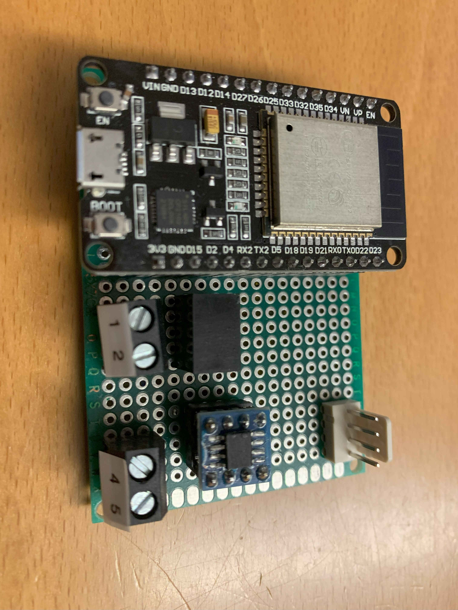
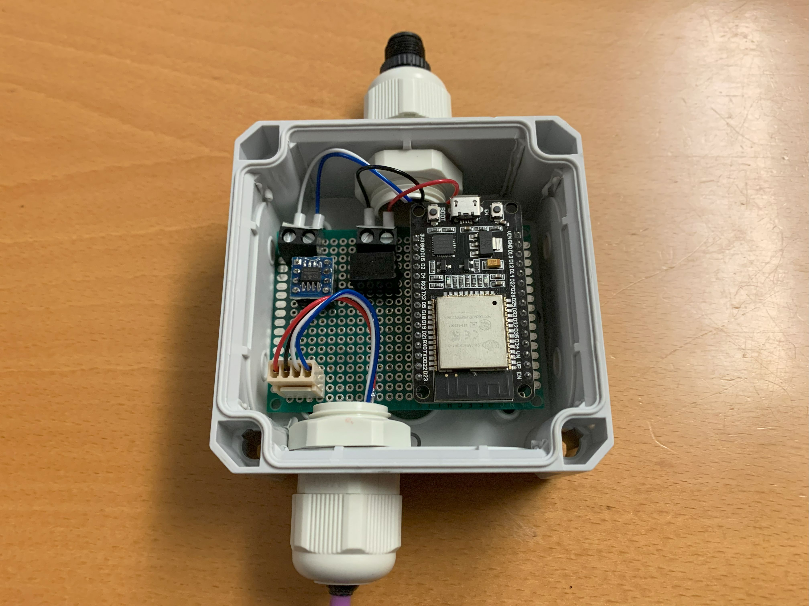

# Hardware
- [Hardware](#hardware)
  - [Schema](#schema)
  - [Sensor](#sensor)
    - [Housing for the sensor](#housing-for-the-sensor)
    - [Mounting the Sensors](#mounting-the-sensors)
  - [ESP32](#esp32)

## Schema

## Sensor
As sensor I used the VL53L0X. The VL53L0X is a Time-of-Flight (ToF) laser-ranging, providing accurate distance measurement whatever the target reflectances. It can measure absolute distances up to 2m.

### Housing for the sensor
The STL file for printing the housing is stored in the folder stl. The housing is filled with casting resin, so no lid is necessary.

### Mounting the Sensors
I drilled a 10mm hole in the tank. Then fix the sensor in the drill hole with Sika flex.

## ESP32

