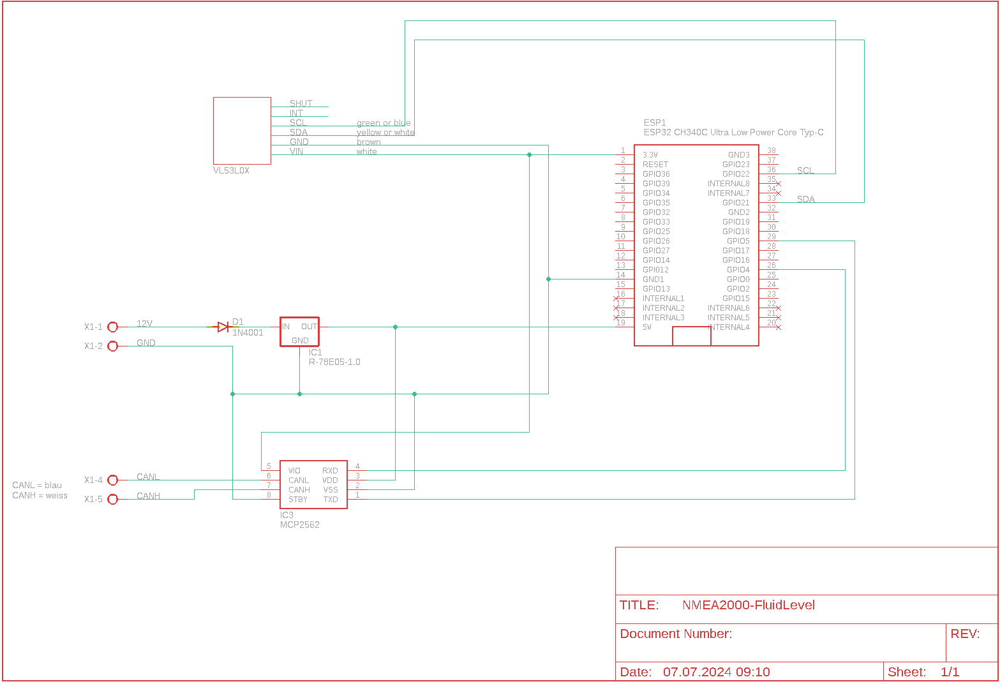

# Hardware
- [Hardware](#hardware)
  - [Schema](#schema)
  - [Part list](#part-list)
    - [Housing for the sensor](#housing-for-the-sensor)
    - [Mounting the Sensors](#mounting-the-sensors)
  - [ESP32](#esp32)

## Schema

## Part list
| Part | Value | Supplier |
| --- | --- | --- |
| D1 | 1N4001 | Reichelt |
| ESP1 | ESP32DEVKITV1 | [ebay](https://www.ebay.ch/itm/204191675506?var=504772734176) |
| IC1 | R-78E05-1.0 | Reichelt |
| IC3 | MCP2562 | Reichelt oder [ebay](https://www.ebay.ch/itm/364610349378) |
| X1 | 2 x AKL 057-03 | Reichelt |
| X3 | PSS 254/4G | Reichelt |
|| VL53L0X | ebay |

### Housing for the sensor
The STL file for printing the housing is stored in the folder stl. The housing is filled with casting resin, so no lid is necessary.

### Mounting the Sensors
I drilled a 10mm hole in the tank. Then fix the sensor in the drill hole with Sika flex.

## ESP32

