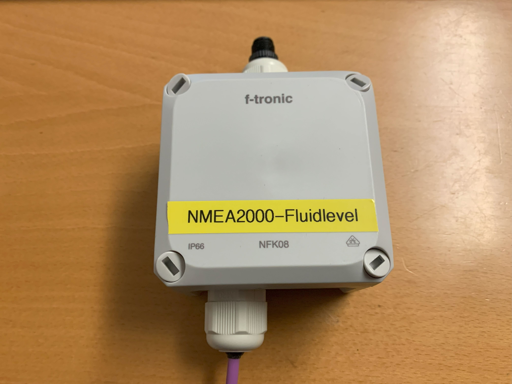

# Hardware
- [Hardware](#hardware)
  - [Schema](#schema)
  - [Sensor](#sensor)
    - [case for the Sensor](#case-for-the-sensor)
    - [installed Sensor](#installed-sensor)
  - [ESP32](#esp32)

## Schema

The following [schema](/sch/NMEA2000-FluidLevel.pdf) show you, how to put all together.

[top](#hardware)

## Sensor
As sensor I used the VL53L0X. The VL53L0X is a Time-of-Flight (ToF) laser-ranging, providing accurate distance measurement whatever the target reflectances. It can measure absolute distances up to 2m.

### case for the Sensor

The STL file for printing the case is stored in the folder stl.

Sensor mountet in the case

### installed Sensor

I drilled a 10mm hole in the tank and then glued the housing on with Sika flex.

[top](#hardware)

## ESP32

