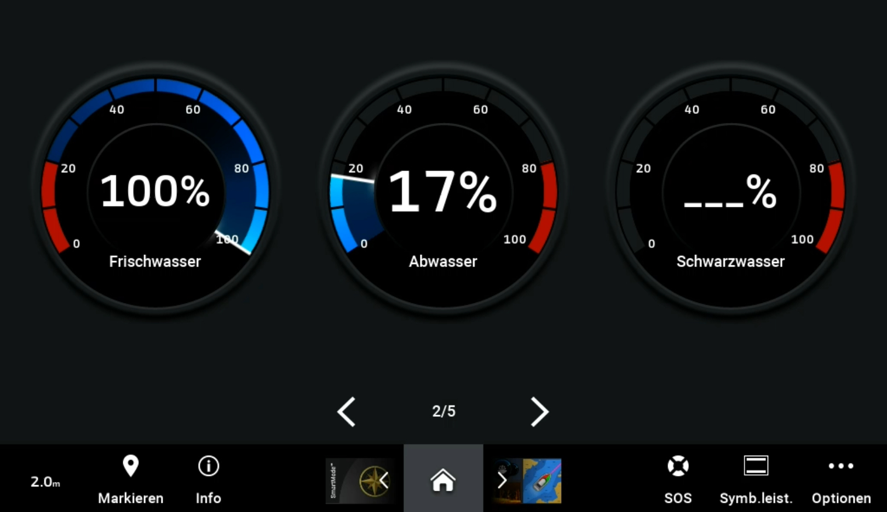
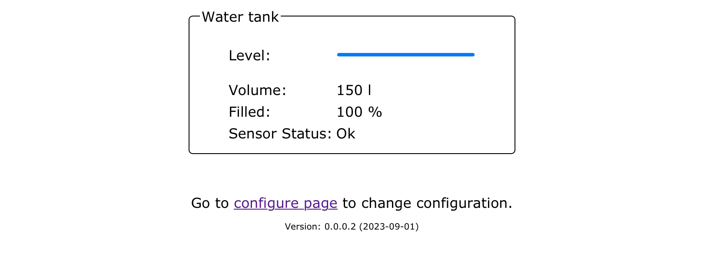

# NMEA 2000 Fluidmonitor



## Table of contents
- [NMEA 2000 Fluidmonitor](#nmea-2000-fluidmonitor)
  - [Table of contents](#table-of-contents)
  - [Description](#description)
  - [NMEA 2000](#nmea-2000)
  - [Libraries](#libraries)
  - [Hardware](#hardware)
  - [VL53L1X Calibration Guide](#vl53l1x-calibration-guide)
    - [Key Measurement Parameters](#key-measurement-parameters)
    - [VL53L1X Calibration Commands](#vl53l1x-calibration-commands)
  - [Configuration](#configuration)
    - [System Configuration](#system-configuration)
      - [Thing name](#thing-name)
      - [AP password](#ap-password)
      - [WiFi SSID](#wifi-ssid)
      - [WiFi password](#wifi-password)
      - [AP offline mode after (minutes)](#ap-offline-mode-after-minutes)
    - [NMEA 2000 Settings](#nmea-2000-settings)
      - [Instance](#instance)
      - [SID](#sid)
    - [Tank](#tank)
      - [Fluid type](#fluid-type)
      - [Capacity](#capacity)
      - [Height](#height)
    - [Sensor](#sensor)
      - [Calibration factor](#calibration-factor)
      - [Calibration via WebSerial](#calibration-via-webserial)
      - [Upper dead zone](#upper-dead-zone)
      - [Lower dead zone](#lower-dead-zone)
  - [Default password](#default-password)
  - [Default IP address](#default-ip-address)
  - [Firmware Update](#firmware-update)
  - [Blinking codes](#blinking-codes)
  - [Reset](#reset)

## Description

A sensor based on a VL53L1X to determine the fill level in a tank. The VL53L1X is a Time-of-Flight (TOF) laser-ranging module. It can measure absolute distances up to 4m, setting a new benchmark in ranging performance levels.
This sensor can be used to determine the fill level in a tank. The sensor VL53L1X is used for this and is a Time-of-Flight (TOF) laser-ranging module. It can measure absolute distances up to 4m.

A measurement is taken every second. The average value is determined from 60 measurements.

 The system communicates via the NMEA 2000 protocol, sending temperature values and alarms as NMEA 2000 messages over an NMEA bus. Configuration is done through a web interface, and real-time values can be viewed on a website. Additionally, there's a link on the configuration page for convenient firmware updates.

 

## NMEA 2000

The following PNG is send by this sensor. 

- 127505

## Libraries
- [VL53L1X_Arduino](https://github.com/minou65/VL53L1X_Arduino)
- [NMEA2000](https://github.com/ttlappalainen/NMEA2000)
- [NMEA2000_esp32](https://github.com/ttlappalainen/NMEA2000_esp32)
- [AsyncTCP (3.2.6) __"__](https://github.com/mathieucarbou/AsyncTCP)
- [ESPAsyncWebServer (3.3.12) __*__](https://github.com/mathieucarbou/ESPAsyncWebServer)
- [WebSerial (2.0.7) __*__](https://github.com/ayushsharma82/WebSerial)
- [IotWebConf](https://github.com/minou65/IotWebConf)
- [IotWebConfAsync (1.0.2) __*__](https://github.com/minou65/IotWebConfAsync)
- [IotWebRoot](https://github.com/minou65/IotWebRoot)

__*__ new version and/or new repo

## Hardware
[Hardware description](/doc/hardware.md)

## VL53L1X Calibration Guide

Navigate to `ipaddress/webserial` to access the calibration interface.

For successful VL53L1X calibration, the following measurement parameters are crucial. The actual distance value is less important - what matters is the stability and quality of the measurement:

```text
Distance: 112 mm | Status: 0 | Signalrate: 1696.00 kcps | Signal/SPAD: 59.00 kcps/SPAD | Ambientrate: 8.00 kcps
Distance: 118 mm | Status: 0 | Signalrate: 1712.00 kcps | Signal/SPAD: 59.00 kcps/SPAD | Ambientrate: 8.00 kcps
Distance: 117 mm | Status: 0 | Signalrate: 1816.00 kcps | Signal/SPAD: 63.00 kcps/SPAD | Ambientrate: 16.00 kcps
Distance: 114 mm | Status: 0 | Signalrate: 1768.00 kcps | Signal/SPAD: 61.00 kcps/SPAD | Ambientrate: 8.00 kcps
```

### Key Measurement Parameters

| Parameter              | Ideal Value                     | Interpretation                                                                 |
|------------------------|----------------------------------|--------------------------------------------------------------------------------|
| **Signalrate** (kcps)     | > 1200 kcps                      | High signal rate indicates strong target reflection. Values > 1000 kcps enable precise calibration. |
|                        |                                  | Values < 500 kcps may lead to failed or inaccurate calibration.                |
| **Signal/SPAD** (kcps/SPAD) | 60–65 kcps/SPAD                  | Indicates efficient SPAD usage. Values in this range suggest good optical coupling and stable conditions. |
| **Ambientrate** (kcps)     | < 20 kcps, ideally < 10 kcps     | Low ambient light interference. Dark environments (e.g., inside tanks) are beneficial. |
|                        |                                  | Values > 40 kcps may degrade measurement quality.                              |
| **Status**              | Status = 0                       | Valid measurement. Other status codes (e.g., 4, 7) indicate errors or invalid data and should be avoided during calibration. |

### VL53L1X Calibration Commands

| Setter Command   | Parameters                     | Range / Format                  | Description                                                                 |
|------------------|--------------------------------|----------------------------------|-----------------------------------------------------------------------------|
| `set_roi`        | `<x> <y> <center>`             | x/y: 4–16, center: 0–255         | Sets Region of Interest (ROI) size and center SPAD.                         |
| `set_offset`     | `<offset>`                    | -500 to +500 mm                 | Sets offset correction in millimeters.                                     |
| `set_xtalk`      | `<xtalk>`                     | 0 to 1000 kcps                  | Sets cross-talk compensation rate.                                         |
| `set_mode`       | `<mode>`                      | 1 = short, 2 = long             | Sets ranging mode (short or long distance).                                |
| `set_sigma`      | `<sigma>`                     | 1 to 200 mm                     | Sets sigma threshold for measurement validity.                             |
| `set_timing`     | `<timing>`                    | 20 to 2000 ms                   | Sets timing budget (integration time).                                     |

| Getter Command   | Parameters                     | Description                                                           |
|------------------|--------------------------------|------------------------------------------------------------------------|
| `get_roi`        | *(none)*                       | Returns current ROI configuration (x, y, center).                      |
| `get_offset`     | *(none)*                       | Returns current offset correction value.                              |
| `get_xtalk`      | *(none)*                       | Returns current cross-talk compensation rate.                         |
| `get_mode`       | *(none)*                       | Returns current ranging mode (short or long).                         |
| `get_sigma`      | *(none)*                       | Returns current sigma threshold.                                      |
| `get_timing`     | *(none)*                       | Returns current timing budget in milliseconds.                        |

| Utility Command      | Parameters     | Description                                                                 |
|----------------------|----------------|-----------------------------------------------------------------------------|
| `reset_calibration`  | *(none)*       | Clears all stored calibration values (offset, xtalk, ROI, etc.) from flash.|
| `reboot`             | *(none)*       | Restarts the microcontroller and reinitializes the sensor.                 |
| `help`               | *(none)*       | Displays a list of available commands and usage instructions.              |


## Configuration
After the first boot, there are some values needs to be set up.
These items are maked with __*__ (star) in the list below.

### System Configuration

#### Thing name
Please change the name of the device to a name you think describes it the most. It is advised to incorporate a location here in case you are planning to set up multiple devices in the same area. You should only use english letters, and the "_" underscore character. Thus, must not use Space, dots, etc. E.g. `fresh_water` __*__

#### AP password
This password is used, when you want to access the device later on. You must provide a password with at least 8, at most 32 characters. You are free to use any characters, further more you are encouraged to pick a password at least 12 characters long containing at least 3 character classes. __*__

#### WiFi SSID
The name of the WiFi network you want the device to connect to. __*__

#### WiFi password
The password of the network above. Note, that unsecured passwords are not supported in your protection. __*__

#### AP offline mode after (minutes)
If you don’t plan to connect the sensor to a WiFi network, you don’t need to configure the two options above. If you want to disable the WiFi after a certain time, you can use this option. Specify how long the WiFi should remain enabled after turning on the sensor. Valid values are from 0 to 30 minutes. A value of 0 means that WiFi is always enabled.

### NMEA 2000 Settings

#### Instance
This should be unique at least on one device. May be best to have it unique over all devices sending this PGN. __*__

#### SID
Sequence identifier. In most cases you can use just 255 for SID. The sequence identifier field is used to tie different PGNs data together to same sampling or calculation time.

### Tank
#### Fluid type
Select the fluid type. can be one of the following
- Fuel
- Water
- Gray water
- Live well
- Oil
- Black water
- Gasoline fuel

#### Capacity
The volume in liters that can be held in the tank. __*__

#### Height
This value is used to calculate the amount of liquid in the tank. __*__

### Sensor
#### Calibration factor
You can calibrate this with a 2 point slope. Take one measurement at 50mm and another at 300mm. Write down the value that the sensor measures. Then calculate the factor according to the following formula

```
factor = (300mm - 50 mm) / ( X1 - X2)

X1 = value for the 300mm measurement
X2 = value for the 50mm measurement

```
Use the factor as your calibration factor. This 2 point slope should give you a good linear fit.

#### Calibration via WebSerial
Calibration and sensor configuration can be performed via the WebSerial console. The following commands are available:

| Command | Description |
| --- | --- |
| `set_roi <x:4-16> <y:4-16> <center:0-255>` | Set the region of interest (ROI) for the sensor. |
| `get_roi` | Show the current ROI settings. |
| `start_calibration <reference distance in mm:50-500>` | Start the calibration procedure with a reference distance.<br>__Use with caution! This should ideally only be performed when the tank is empty, as it sets the sensor's baseline.__ |
| `get_calibration` | Show the current calibration values (offset and cross-talk). |
| `set_mode <1=short,2=long>` | Set the sensor mode (short or long distance). |
| `get_mode` | Show the current sensor mode. |
| `help` | Show all available commands. |

Example usage:

```text
start_calibration 140
get_calibration
set_roi 8 8 199
get_roi
set_mode 2
get_mode
```

#### Upper dead zone
This value determines the dead zone at the top of the tank. If the reading is less than this value, then the tank is considered as full.

#### Lower dead zone
This value determines the dead zone at the bottom of the tank. If the measured value is greater than the tank height - lower dead zone, then the tank is considered as full.

## Default password
When not connected to an AP the default password is 123456789

## Default IP address
When in AP mode, the default IP address is 192.168.4.1

## Firmware Update
To update the firmware, navigate to the Configuration page and click on the Firmware Update link. Follow the on-screen instructions to complete the update process.

## Blinking codes
Prevoius chapters were mentioned blinking patterns, now here is a table summarize the menaning of the blink codes.

| Blinking Pattern | Meaning |
| --- | --- |
| Rapid blinking <\br>(mostly on, interrupted by short off periods) | Entered Access Point mode. This means the device creates its own WiFi network. You can connect to the device with your smartphone or WiFi capable computer. |
| Alternating on/off blinking | Trying to connect to the configured WiFi network. |
| Mostly off with occasional short flash | The device is online. |
| Mostly off with occasional long flash | The device is in offline mode |

## Reset
When CONFIG_PIN is pulled to ground on startup, the Thing will use the initial
password to buld an AP. (E.g. in case of lost password)

Reset pin is GPIO 13
