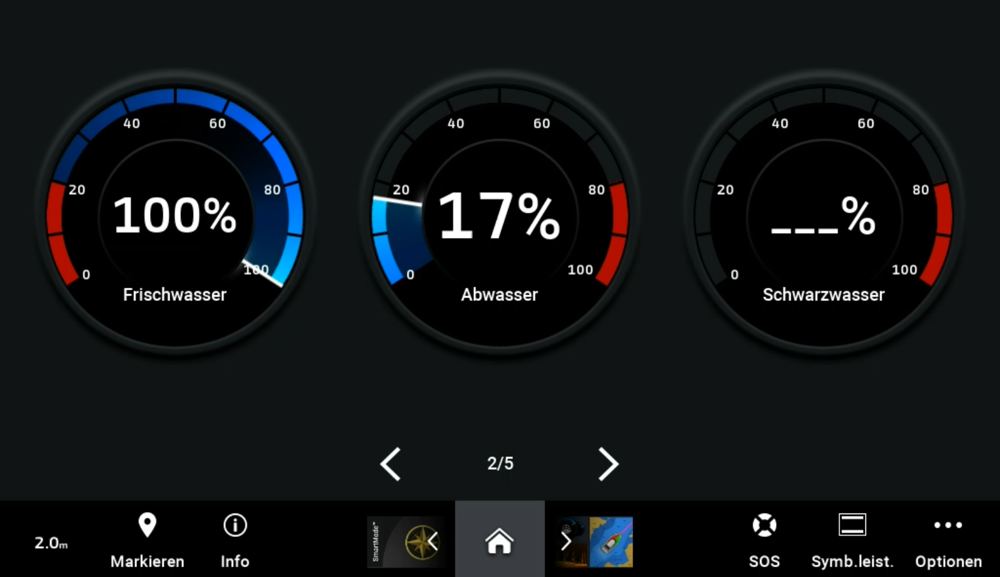
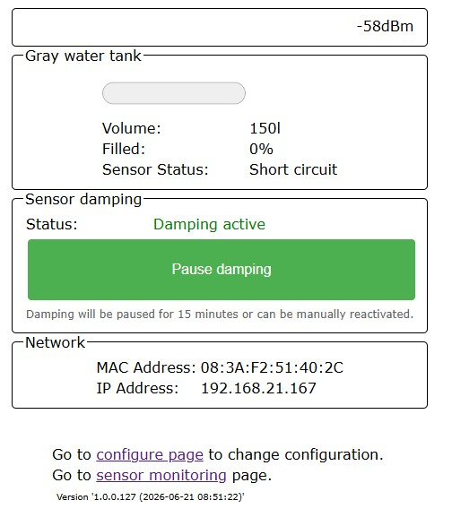

# NMEA 2000 Fluidmonitor

<table>
  <tr>
    <td></td>
    <td align="right" valign="top" style="padding-left: 200px;"></td>
  </tr>
</table>

## Table of contents
- [NMEA 2000 Fluidmonitor](#nmea-2000-fluidmonitor)
  - [Table of contents](#table-of-contents)
  - [Description](#description)
  - [Related Projects](#related-projects)
  - [Hardware](#hardware)
  - [NMEA 2000](#nmea-2000)
  - [Libraries](#libraries)
  - [Configuration](#configuration)
    - [System Configuration](#system-configuration)
    - [NMEA 2000 Settings](#nmea-2000-settings)
    - [Tank](#tank)
    - [Sensor Calibration](#sensor-calibration)
  - [First Start](#first-start)
    - [Default IP address](#default-ip-address)
  - [Operation](#operation)
    - [Web UI (Home/Monitoring page)](#web-ui-homemonitoring-page)
      - [Sensor damping behavior](#sensor-damping-behavior)
    - [Firmware Update](#firmware-update)
    - [Blinking codes](#blinking-codes)
    - [Reset](#reset)

## Description

Note: This project also provides one branch each for the VL53L1X sensor variant and the VL53L0X sensor variant.

A resistive sensor-based system to determine the fill level in a tank. This device uses a 240-33 Ohm resistive level sensor where:
- **33 Ohm** = Tank FULL (100%)
- **240 Ohm** = Tank EMPTY (0%)
- **Open circuit** (no connection) = Detected as EMPTY
- **Short circuit** (0 Ohm) = Detected as EMPTY

A measurement is taken every second, and the average value is determined from 60 measurements. The system automatically detects fault conditions (open lines and short circuits).

The system communicates via the NMEA 2000 protocol, sending fluid level values as NMEA 2000 messages over an NMEA bus. Configuration is done through a web interface, and real-time values can be viewed on a website. Additionally, there's a link on the configuration page for convenient firmware updates.

## Related Projects

| Project | Description |
| --- | --- |
| [NMEA2000-DS1820](https://github.com/minou65/NMEA2000-DS1820) | Temperature monitor for up to 4 DS1820 sensors (-50 C to +125 C) with configurable alerts |
| [NMEA2000-FluidLevel](https://github.com/minou65/NMEA2000-FluidLevel) | Tank fill-level monitor using a VL53L0X time-of-flight sensor |
| [NMEA2000-BME280](https://github.com/minou65/NMEA2000-BME280) | Environmental sensor for temperature, humidity and air pressure |
| [NMEA2000-BatteryMonitor](https://github.com/minou65/NMEA2000-BatteryMonitor) | Battery monitor using an INA226 (voltage, current, SoC, time-to-go) |
| [NMEA2000-SensorBoard](https://github.com/minou65/NMEA2000-SensorBoard/tree/main) | Base hardware platform with schematic, PCB, and printable enclosure |

## Hardware

The hardware of the fluid level is based on the NMEA SensorBoard:

- [minou65/NMEA2000-SensorBoard](https://github.com/minou65/NMEA2000-SensorBoard)

A printable enclosure is also available in the SensorBoard project.

Populate the following components:

| Part | Value | Device | Package |
| --- | --- | --- | --- |
| C1 | 47u/25V | CPOL-EUE5-8.5 | E5-8,5 |
| C2 | 100n | C-EU050-024X044 | C050-024X044 |
| D1 | 1N4001 | 1N4148 | SOD80 |
| IC1 | R-78E05-1.0 | R-78E-XX1.0 | R-78E-XX1.0 |
| IC2 | ESP32_D1_MINI | ESP32_D1_MINI | ESP32_D1_MINI |
| IC3 | MCP2562 | MCP2562SMD | SO-8 |
| R1 | 270R | R-EU_R0805 | R0805 |
| X1 |  | AK500/3 | AK500/3 |
| X2 |  | AK500/2 | AK500/2 |
| X3 | Sender 220-33 Ohm | 22-23-2031 | 22-23-2031 |

Remark: The sender (220-33 Ohm) must be connected to pins X3-2 and X3-3.

Sensor photos:

| Open housing with wiring | Assembled sender |
| --- | --- |
|  |  |

## NMEA 2000

The following PGN is sent by this sensor:

- 127505 (Fluid Level)

## Libraries
- [NMEA2000](https://github.com/ttlappalainen/NMEA2000)
- [NMEA2000_esp32](https://github.com/ttlappalainen/NMEA2000_esp32)
- [AsyncTCP (3.2.6) __"__](https://github.com/mathieucarbou/AsyncTCP)
- [ESPAsyncWebServer (3.3.12) __*__](https://github.com/mathieucarbou/ESPAsyncWebServer)
- [WebSerial (2.0.7) __*__](https://github.com/ayushsharma82/WebSerial)
- [IotWebConf](https://github.com/minou65/IotWebConf)
- [IotWebConfAsync (1.0.2) __*__](https://github.com/minou65/IotWebConfAsync)
- [IotWebRoot](https://github.com/minou65/IotWebRoot)

__*__ new version and/or new repo  
__"__ AsyncTCP fork with additional features

## Configuration
After first boot, open `/config` and set the required values.

Fields marked with __*__ are required for first commissioning.

### System Configuration

| Parameter | Description | Range / Default | Required |
| --- | --- | --- | --- |
| Thing name | Device name. Use letters and `_` (for example `fresh_water`). Avoid spaces and dots. | - | __*__ |
| AP password | Password for later access to the device AP/web UI. | 8..32 chars (recommended: >=12 with mixed classes) | __*__ |
| WiFi SSID | Name of the WiFi network to connect to. | - | __*__ |
| WiFi password | Password of the WiFi network (open networks are not supported). | - | __*__ |
| Startup delay (seconds) | Delay before normal operation starts (IotWebConf AP timeout behavior). | default: **30 s** | optional |
| AP offline mode after (minutes) | Time after startup until AP is disabled. Set `0` to keep WiFi always enabled. | `0..30 min` | optional |

### NMEA 2000 Settings

| Parameter | Description | Range / Default | Required |
| --- | --- | --- | --- |
| Instance | Device instance for PGN 127505. Should be unique for devices sending this PGN. | `1..254` | __*__ |
| SID | Sequence identifier used to correlate PGNs sampled at the same time. | `1..255`, default: **255** | optional |

### Tank

| Parameter | Description | Range / Default | Required |
| --- | --- | --- | --- |
| Fluid type | Select one: Fuel, Water, Gray water, Live well, Oil, Black water, Gasoline fuel. | predefined list | optional |
| Capacity | Tank volume in liters. | `1..1000 l`, default: **150 l** | __*__ |

### Sensor Calibration

This section calibrates the resistive sender used for level calculation.

Calibration options:
1. Removed sender: measure resistance at FULL and EMPTY positions, then enter both values.
2. Installed sender: use `/webserial` to observe the values for FULL and EMPTY, then enter both values.

| Parameter | Description | Range / Default |
| --- | --- | --- |
| Resistance Full (Ohm) | Sender resistance at full tank level. | `1..500 Ohm`, default: **33.0 Ohm** |
| Resistance Empty (Ohm) | Sender resistance at empty tank level. | `1..500 Ohm`, default: **240.0 Ohm** |

## First Start

On first startup, if no WiFi is configured, the device enters AP mode.

- Default AP password: `123456789`

### Default IP address
When running in AP mode, open the web interface at `http://192.168.4.1`.

## Operation

### Web UI (Home/Monitoring page)
The root page (`/`) provides a live monitoring overview:

| Area | Content |
| --- | --- |
| RSSI | Signal strength in dBm |
| Tank | Tank type, fill bar (%), volume (l), fill value (%), sensor status (`OK`, `Open circuit`, `Short circuit`) |
| Sensor damping | Current damping state and control button |
| Network | MAC address and current IP address |
| Links | `/config` (configuration), `/webserial` (sensor monitoring) |

#### Sensor damping behavior

| State / Action | Behavior |
| --- | --- |
| Default | **Damping active** |
| Press **Pause damping** | Damping is disabled for 15 minutes |
| While paused | Button shows **Enable damping (mm:ss)**, status is **Damping paused**, output uses current reading (not averaged) |
| End of pause | Damping is re-enabled automatically after 15 minutes, or immediately via **Enable damping** |

### Firmware Update
1. Open `/config`.
2. Select the **Firmware Update** link.
3. Follow the on-screen update instructions.

### Blinking codes
The LED blink pattern indicates the current operating mode:

| Blinking Pattern | Meaning |
| --- | --- |
| Rapid blinking  (mostly on, interrupted by short off periods) | Access Point mode is active. The device creates its own WiFi network for setup. |
| Alternating on/off blinking | Trying to connect to the configured WiFi network. |
| Mostly off with occasional short flash | The device is online. |
| Mostly off with occasional long flash | The device is in offline mode. |

### Reset
To recover access (for example after losing credentials), pull `CONFIG_PIN` to GND during startup.
The device then starts AP mode using the initial password.

Reset pin: `GPIO 13`
