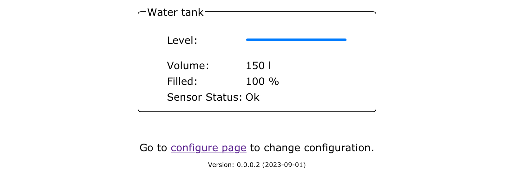

# NMEA 2000 Fluidmonitor

## Table of contents
- [NMEA 2000 Fluidmonitor](#nmea-2000-fluidmonitor)
  - [Table of contents](#table-of-contents)
  - [Description](#description)
  - [NMEA 2000](#nmea-2000)
  - [Libraries](#libraries)
  - [Configuration](#configuration)
    - [System Configuration](#system-configuration)
      - [Thing name](#thing-name)
      - [AP password](#ap-password)
      - [WiFi SSID](#wifi-ssid)
      - [WiFi password](#wifi-password)
      - [AP offline mode after (minutes)](#ap-offline-mode-after-minutes)
    - [NMEA 2000 Settings](#nmea-2000-settings)
      - [Instance](#instance)
      - [SID](#sid)
    - [Tank](#tank)
      - [Fluid type](#fluid-type)
      - [Capacity](#capacity)
  - [First Start](#first-start)
    - [Default IP address](#default-ip-address)
  - [Operation](#operation)
    - [Firmware Update](#firmware-update)
    - [Blinking codes](#blinking-codes)
    - [Reset](#reset)

## Description

A resistive sensor-based system to determine the fill level in a tank. This device uses a 240-33 Ohm resistive level sensor where:
- **33 Ohm** = Tank FULL (100%)
- **240 Ohm** = Tank EMPTY (0%)
- **Open circuit** (no connection) = Detected as EMPTY
- **Short circuit** (0 Ohm) = Detected as EMPTY

A measurement is taken every second, and the average value is determined from 60 measurements. The system automatically detects fault conditions (open lines and short circuits).

The system communicates via the NMEA 2000 protocol, sending fluid level values as NMEA 2000 messages over an NMEA bus. Configuration is done through a web interface, and real-time values can be viewed on a website. Additionally, there's a link on the configuration page for convenient firmware updates.

## NMEA 2000

The following PGN is sent by this sensor:

- 127505 (Fluid Level)

## Libraries
- [NMEA2000](https://github.com/ttlappalainen/NMEA2000)
- [NMEA2000_esp32](https://github.com/ttlappalainen/NMEA2000_esp32)
- [AsyncTCP (3.2.6) __"__](https://github.com/mathieucarbou/AsyncTCP)
- [ESPAsyncWebServer (3.3.12) __*__](https://github.com/mathieucarbou/ESPAsyncWebServer)
- [WebSerial (2.0.7) __*__](https://github.com/ayushsharma82/WebSerial)
- [ArduinoOTA](https://github.com/esp8266/Arduino/tree/master/libraries/ArduinoOTA) (ESP32 Core Library)
- [IotWebConf](https://github.com/minou65/IotWebConf)
- [IotWebConfAsync (1.0.2) __*__](https://github.com/minou65/IotWebConfAsync)
- [IotWebRoot](https://github.com/minou65/IotWebRoot)

__*__ new version and/or new repo  
__"__ AsyncTCP fork with additional features

## Configuration
After the first boot, there are some values that need to be set up.
These items are marked with __*__ (star) in the list below.

### System Configuration

#### Thing name
Please change the name of the device to a name you think describes it the most. It is advised to incorporate a location here in case you are planning to set up multiple devices in the same area. You should only use english letters, and the "_" underscore character. Thus, must not use Space, dots, etc. E.g. `fresh_water` __*__

#### AP password
This password is used when you want to access the device later on. You must provide a password with at least 8, at most 32 characters. You are free to use any characters, furthermore you are encouraged to pick a password at least 12 characters long containing at least 3 character classes. __*__

#### WiFi SSID
The name of the WiFi network you want the device to connect to. __*__

#### WiFi password
The password of the network above. Note that unsecured networks are not supported for your protection. __*__

#### AP offline mode after (minutes)
If you don't plan to connect the sensor to a WiFi network, you don't need to configure the two options above. If you want to disable the WiFi after a certain time, you can use this option. Specify how long the WiFi should remain enabled after turning on the sensor. Valid values are from 0 to 30 minutes. A value of 0 means that WiFi is always enabled.

### NMEA 2000 Settings

#### Instance
This should be unique at least on one device. May be best to have it unique over all devices sending this PGN. __*__

#### SID
Sequence identifier. In most cases you can use just 255 for SID. The sequence identifier field is used to tie different PGNs data together to the same sampling or calculation time.

### Tank
#### Fluid type
Select the fluid type. Can be one of the following:
- Fuel
- Water
- Gray water
- Live well
- Oil
- Black water
- Gasoline fuel

#### Capacity
The volume in liters that can be held in the tank. __*__

## First Start

#When not connected to an AP the default password is 123456789

### Default IP address
When in AP mode, the default IP address is 192.168.4.1

## Operation

### Web UI (Home/Monitoring page)
The root page (`/`) shows the live monitoring overview:

- **RSSI** (signal strength in dBm)
- **Tank section** with:
  - Tank type (for example: Gray water tank)
  - Progress bar (fill level in %)
  - Volume (configured capacity in liters)
  - Filled (%)
  - Sensor status (for example: `OK`, `Open circuit`, `Short circuit`)
- **Sensor damping** section with status and control button
- **Network** section (MAC address and current IP address)
- Links to:
  - `/config` (configure page)
  - `/webserial` (sensor monitoring page)

#### Sensor damping behavior
- Default state is **Damping active**.
- Pressing **Pause damping** disables damping for 15 minutes.
- While damping is paused:
  - The button changes to **Enable damping (mm:ss)**.
  - Status changes to **Damping paused**.
  - Fill value output uses the **current** reading instead of the averaged value.
- Damping resumes automatically after 15 minutes, or immediately when **Enable damping** is pressed.

### Firmware Update
To update the firmware, navigate to the Configuration page and click on the Firmware Update link. Follow the on-screen instructions to complete the update process.

### Blinking codes
Previous chapters mentioned blinking patterns, now here is a table summarizing the meaning of the blink codes.

| Blinking Pattern | Meaning |
| --- | --- |
| Rapid blinking  (mostly on, interrupted by short off periods) | Entered Access Point mode. This means the device creates its own WiFi network. You can connect to the device with your smartphone or WiFi capable computer. |
| Alternating on/off blinking | Trying to connect to the configured WiFi network. |
| Mostly off with occasional short flash | The device is online. |
| Mostly off with occasional long flash | The device is in offline mode |

### Reset
When CONFIG_PIN is pulled to ground on startup, the Thing will use the initial
password to build an AP. (E.g. in case of lost password)

Reset pin is GPIO 13
